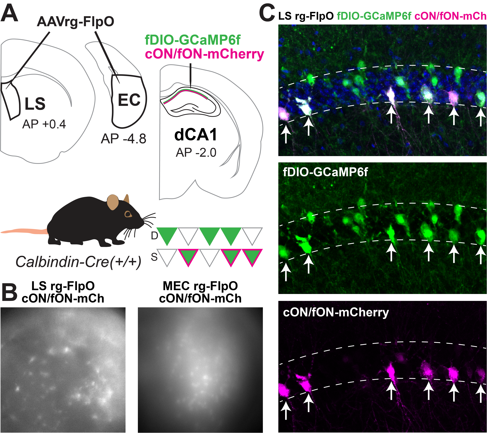
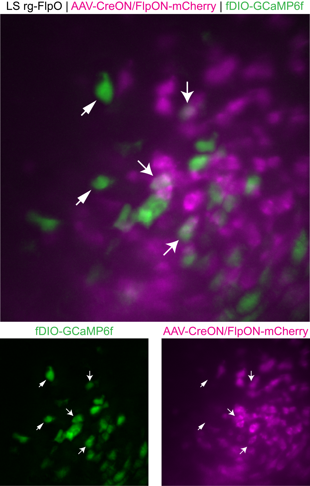

# In Vivo Dual Labeling: Projection-Specific and Sublayer-Specific Neuronal Identification

## Overview

This document presents a novel approach for precisely identifying hippocampal CA1 neurons based on two criteria: **sublayer identity** (deep vs. superficial) and **projection target** (lateral septum vs. entorhinal cortex).

---

## Biological Significance

### Sublayer Organization
The CA1 pyramidal layer contains functionally distinct sublayers:
- **Deep sublayer**
- **Superficial sublayer**

### Projection Target Specificity
CA1 pyramidal neurons may exhibit distinct functional properties based on their downstream projection targets:
- **LS-projecting neurons**
- **EC-projecting neurons**

---

## Experimental Design

### Dual Labeling Strategy
Mouse genetic line: 
 - Calbindin-cre (expresses Cre in superficial neurons only)
AAVs: 
 - Retrograde Flp (expresses Flp in all neurons that project to downstream target region (EC or LS)
   - Thus, neurons that only express Flp are deep, neurons that express Cre and Flp are superficial
 - Flp-dependent GCaMP6f (all neurons projecting to one brain region will express GCaMP6f)
 - Cre&Flp-dependent mCherry (superficial neurons projecting to one brain region express mCherry)

---

## Results

### Neuronal Population Identification
#### Figure 1: Dual Labeling Visualization

---

#### Video 1: Video of lateral septum-projecting deep and superficial neurons
https://github.com/user-attachments/assets/f46bb74f-e3a9-4426-b875-0283c101dee7

### Figure #2: Image of superficial lateral septum-projecting neurons

