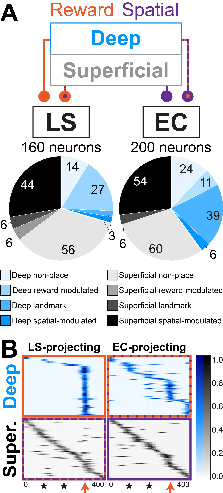
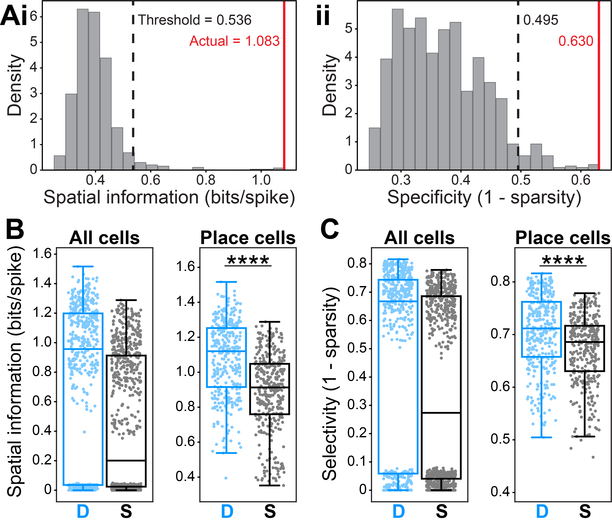
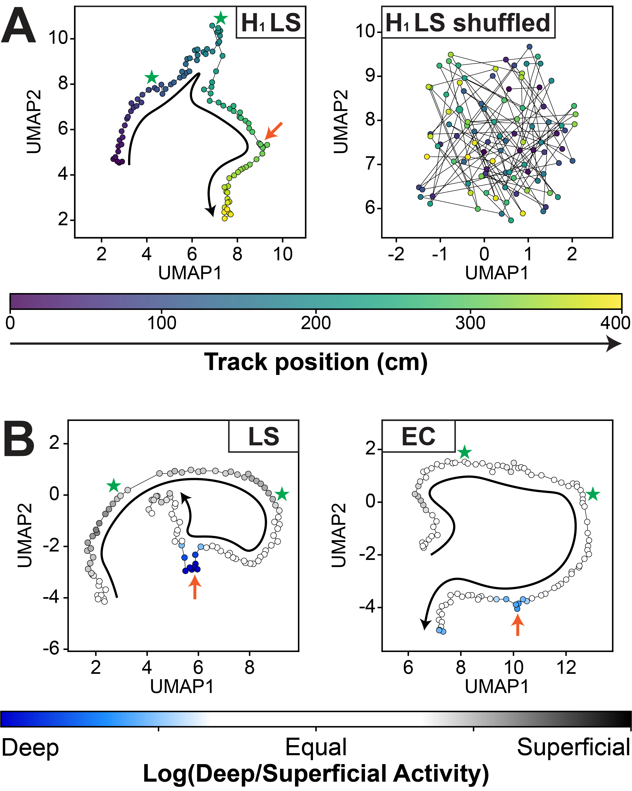
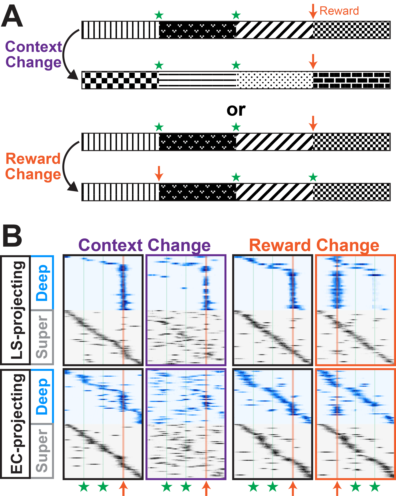

# Simulating the dataset: both projection class (as different animals) and sublayer (within animals)

## Overview

This code simulates 5 main types of cells as a mouse runs along a virtual linear track. 
 - Spatial
 - Reward-modulated
 - Landmark
 - Boundary
 - Non-place cells

---

## Simulated data examples

#### Video 1: Simulating activity of 10 example neurons
https://github.com/user-attachments/assets/9674ad2a-fc47-4b65-a496-e4902c762010

#### Video 2: Simulating activity of 300 example neurons (both place and non-place cells)
https://github.com/user-attachments/assets/60ebae7c-8e36-4871-9666-ff0ed2d90448

---

## Simulating specific subpopulations of place cells;

#### Figure 1: simulating 2 mice with 2 populations of cells per mouse
*Mouse #1 = LS-projecting, deep and superficial populations recorded simultaneously*
*Mouse #2 = EC-projecting, deep and superficial populations recorded simultaneously*

## Analyzing simulated place cells

#### Figure 2: Classification of place cells

#### Figure 3: Sample population data

---

## Simulating remapping during dnvironmental changes

#### Figure 4: Example remapping of a population

